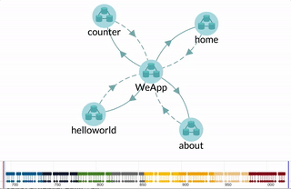

# Collux框架 微信小程序模版

Collux框架可以可视化微信小程序架构，数据流，从而更好的帮助您编写和维护您的程序。

Collux是基于[collar.js](http://collarjs.com)的一个微信小程序开发库，他提供了一个基于消息的数据流框架。

## 架构

使用Collux编写的小程序的架构就像一朵花。中心是微信小程序页面控制器，花瓣是每个页面的业务逻辑。 他们之间发送消息进行通信。他们之间的消息交互可以通过collar dev tool动态显示出来。见以下gif截图：



中心是微信小程序页面控制器，主要负责4个任务：

1. 更新页面 (update page)
2. 跳转页面 (redirect page)
3. 切换页面 (navigate page)
4. 切换tabBar (switch tab)

花瓣是每个页面的业务逻辑，负责处理页面产生的各种事件。你可以在业务逻辑中调用上面提到的4种页面控制任务。

在你的页面内，可以通过页面传感器（viewSensor）向页面业务逻辑发送消息。


## 如何添加一个页面

- 在/pages目录下添加一个页面目录，比如 test。添加三个页面文件：test.js, test.wxml, test,wxss
- 编辑页面javascript文件，添加如下基本代码

```javascript
import biz from '../../lib/bundle';
// 获得这个view的sensor，用来发送消息, 请根据你的页面名称更改参数
// 更改test为你的view的名字，这个名字是你在src/index.js里注册页面时的路径名 （/test）
const viewSensor = biz.getViewSensor('test'); 

Page({
  data: {
  }  
});
```
页面的代码文件不包含任何业务逻辑，他仅仅负责接受用户输入，然后通过viewSensor把消息发送给业务逻辑

- 在src目录下添加页面对应的业务逻辑文件
```javascript
export default function businessLogic(page) {
  return page;
}
```

你可以在这个文件里面使用collar.js API添加业务逻辑数据流，比如：

```javascript
page.when('ON_LOAD')
  .map('set init state', s => {
    return s.set(Constants.STATE, {
      // init state object
    });
  })
  .to(page.viewUpdater);
```

- 在src/index.js中，注册这个页面
```javascript
import collux from './collux';
import test from './test';

// 发布小程序的时候，请注释以下代码，
import DevToolAddon from './devtool/DevToolAddon';
collux.use(new DevToolAddon({
  process: 'wechatapp',
}));

const app = collux.createApp('your app name');

app.route('test', test);  // 第一个参数是页面逻辑对应的页面名

export default app;
```


## 可视化程序架构和数据流

首先安装collar-dev-server微信小程序版

```text
sudo npm install collar-dev-server -g
```

运行collar-dev-server

````text
collar-dev-server
````

在浏览器打开collar dev tool: [http://localhost:7500/?view=hierarchy.td&perspective=arch](http://localhost:7500/?view=hierarchy.td&perspective=arch)

在微信web开发者工具运行小程序，你就可以在collar dev tool里面看到小程序的架构和数据流了。


## 如何使用

- 监听文件变化并打包代码
```text
npm run build
```

- 在微信Web开发者工具里调试

